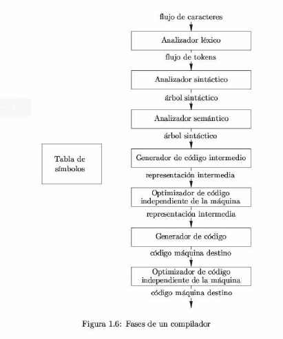
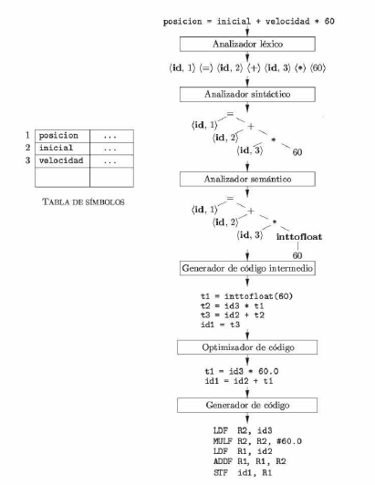

# 1.2 La estructura de un compilador

De momento, al compilador se le ha tratado como una caja simple que mapea un programa fuente a un programa destino con equivalencia semántica. Si lo analisamos un poco, nos damos cuenta que existen dos procesos en esta asignación: **análisis** y **síntesis**.   

El **análisis**: Divide el programa fuente en componentes e impone una estructura gramatical sobre ellas. Después esta estructura la utiliza para crear una representación intermedia del programa fuente. Si se detecta que el programa fuente está mal formado en cuanto a la sintaxis, o que no tiene una semantica consistente, entonces debe proporcionar mensajes informativos para que el usuario pueda corregirlo. La parte del análisis también recolecta información sobre el programa fuente y almacena una estructura de datos llamada **_tabla de símbolos_**, la cual se pasa junto con la representación intermedia a la parte de la síntesis.   

La **síntesis**: Construye el programa destino deseado a partir de la representación intermedia y de la información en la tabla de símbolos.

> A la parte del análisis se le llama comunmente _frontend_ y a la parte de la síntesis _backend_.   

Si examinamos el proceso de compilación con más detalle vemos que opera en forma de _fases_, cada una de las cuales transforma una representación del programa fuente en otro. En la figura 1.6 se muestra una descomposición típica de un compilador en fases. **En la práctica, varias fases pueden agruparse, y las representaciones intermediarias entre las fases agrupadas no necesitan construirse de manera explícita**. La tabla de símbolos, que almacena información sobre el programa fuente, se utiliza en todas las fases del compilador.

> Algunos compiladores tienen una fase de optimización de código independiente de la máquina, entre el _frontend_ y el _backend_. Como esta es opcional, puede faltar una de las dos fases de optimización de la figura 1.6.   

   

## 1.2.1 Análisis de Léxico

A la primera fase de un compilador se le llama análisis de léxico o escaneo. El analizador de léxico lee el flujo de caracteres que componen el programa fuente y los agrupa en secuencias significativas, conocidas como lexemas. Para cada lexema, el analizador léxico produce como salida un token de la forma:   

```xml
<nombre-token, valor-atributo>
```

que pasa a la fase siguiente, el análisis de síntaxis. En el token, el primer componente _nombre-token_ es un símbolo abstracto que se utiliza durante el análisis sintáctico, y el segundo componente _valor-atributo_ apunta a una entrada en la tabla de símbolos para este token. La información de la entrada en la tabla de símbolos se necesita para el análisis semántico y la generación de código.   

Por ejemplo, suponga que un programa fuente contiene la instrucción de asignación:   

```python
posicion = inicial + velocidad * 60  (1.1)
```

Los caracteres en esta asignación podrían agruparse en los siguientes lexemas y mapearse a los siguientes tokens que se pasan al analizador sintáctico.   

1. **posición** es un lexema que se asigna a un token **<id,1>** en donde **id** es un símbolo abstracto que representa la palabra _identificador_ y **1** apunta a la entrada de la tabla de símbolos para **posición**. La entrada en la tabla de símbolos para un identificador contiene información acerca de éste, como su nombre y tipo.   
2. El símbolo de asignación **=** es un lexema que se asigna al token **<=>**. Como este token no necesita un _valor-atributo_, hemos omitido el segundo componente.   
3. **inicial** es un lexema que se asigna al token **<id,2>**, en donde 2 apunta a la entrada en la tabla de símbolos para **inicial**.   
4. **+** es un lexema que se asigna al token **<+>**.   
5. **velocidad** es un lexema que se asigna al token **<id,3>**, en donde 3 apunta a la tabla de símbolos para **velocidad**.   
6. **\*** es un lexema que asigna al token **<*>**.   
7. 60 es un lexema que se asigna al token **<60>**.   

El analizador léxico ignora los espacios en blanco que separan los lexemas.   
La figura 1.7 muestra la representación de la instrucción de asignación 1.1 después del análisis léxico como la secuencia de tokens.   

``` xml
<id,1> <=> <id,2> <+> <id,3> <*> <60>
```
En esta representación, los nombres de los tokens =, + y * son símbolos abstractos para los operadores de asignación, suma y multiplicación, respectivamente.   


> Figura 1.7 Traducción de una instrucción de asignación.

## 1.2.2 Análisis Sintáctico   

La segunda fase del compilador es el analizador sintáctico o _parser_. El parser utiliza los primeros componentes de los tokens producidos por el analizador de léxico para crear una representación intermedia en forma de árbol que describa la estructura gramatical del flujo de tokens. Una representación típica es el _árbol sintáctico_, en el cual cada nodo interior representa una operación y los hijos del nodo representan los argumentos de la operación. En la figura 1.7 se muestra un árbol sintáctico para el flujo de tokens (1.2) como salida del analizador sintáctico.   
Este árbol muestra el orden en que debe llevarse a cabo las operaciones en la siguiente asignación:

```python
        posicion = inicial + velocidad * 60
```

El árbol tiene un nodo interior etiquetado como *, con <id,3> como su hijo izquierdo, y el entero 60 como su hijo derecho. El nodo <id,3> representa el identidicador `velocidad`. El nodo etiquetado como * hace explicito que primero debemos multiplicar el valor de la `velocidad` por 60. El nodo etiquetado como `+` indica que debemos sumar el resultado de esta multiplicación al valor `inicial`. La raíz del árbol, que se etiqueta como `=`, indica que debemos almacenar el resultado de esta suma en la ubicación para el identifiador de `posicion`. Este ordenamiento de operaciones es consistente con las convenciones usuales de la aritmética, las cuales nos indican que la multiplicación tiene mayor procedencia que la suma y, por ende, debe realizarse antes que la suma.   
Las fases siguientes del compilador utilizan la estructura gramatical para ayudar a analizar el programa fuente y generar el programa destino. En el capítulo 4 se usarán gramáticas libres de contexto para especificar la estructura gramatical de los lenguajes de programación, y hablaremos sobre los algoritmos para construir analizadores sintácticos eficientes de manera automática, a partir de ciertas clases gramáticas. En los capítulos 2 y 5 veremos que las definiciones orientadas a la sintaxis pueden ayudar a especificar la traducción de las construcciones del lenguaje de programación.   

## 1.2.3 Análisis semántico
