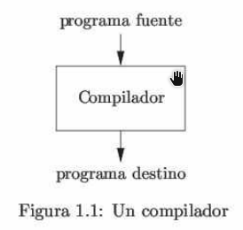
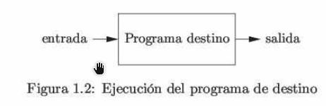
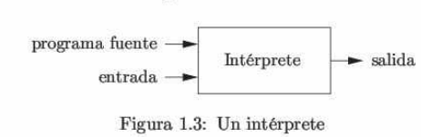

# 1. Introducción

Los lenguajes de programación son notaciones que describen los cálculos a las personas y a las máquinas. Nuestra percepción del mundo en que vivimos depende de los lenguajes de programación, ya que todo el software que se ejecuta en todas las computadoras se escribió en algún lenguaje de programación. Pero antes de poder ejecutar un programa, primero debe traducirse a un formato en el que una computadora pueda ejecutarla.   

Los sistemas de software que se encargan de esta traducción se llaman compiladores.   

El estudio de la escritura de compiladores se relaciona con los lenguajes de programación, la arquitectura de las máquinas, la teoría de lenguajes, los algoritmos y la ingeniería de software.   

En este capítulo de introducción presentaré las distintas formas de los traductores de lenguaje, y hablaremos sobre las tendencias en los lenguajes de programación y la arquitectura de las máquinas que dan forma a los compiladores. Incluiré algunas observaciones sobre la relación entre el diseño de los compiladores y la teoría de las ciencias computacionales, y un esquema de las aplicaciones de tecnología sobre los compiladores que van más allá de la compilación y terminaré con una breve descripción de los conceptos clave de los lenguajes de programación que necesitaremos para nuestro estudio de los compiladores.   

## 1.1 Procesadores de lenguaje.

Dicho de una forma simple, un compilador es un programa que puede leer un programa en un lenguaje (el lenguaje _fuente_) y traducirlo en un programa equivalente en otro lenguaje (lenguaje _destino_). **Vease figura 1.1.** Una función importante del compilador es reportar cualquier error en el programa fuente que detecte durante el proceso de traducción.

   

Si el programa destino es un programa ejecutable en lenguaje máquina, entonces el usuario puede ejecutarlo para procesar las entradas y producir salidas (resultados); **Vea la figura 1.2**   

   

Un intérprete es otro tipo común de procesador de lenguaje. En vez de producir un programa destino como una traducción, el interprete nos da la apariencia de ejecutar directamente las operaciones especificadas en el programa origen (fuente) con las entradas proporcionadas por el usuario, como se muestra en la figura 1.3.   

   

El programa destino en el lenguaje máquina que produce un compilador es, por lo general, más rápido que un intérprete al momento de asignar las entradas a las salidas. No obstante, por lo regular, el intérprete puede ofrecer mejores diagnósticos de error que un compilador, ya que ejecuta el programa fuente instrucción por instrucción.   

**Ejemplo 1.1**   

Los procesadores del lenguaje Java combinan la compilación y la interpretación, como se muestra en la **figura 1.4** 
