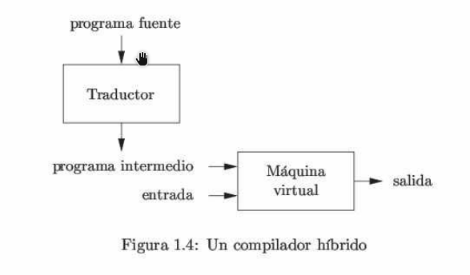
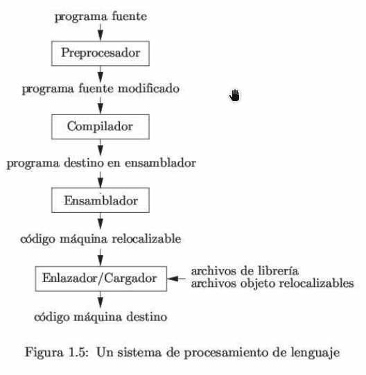

# 1. Introducción

Los lenguajes de programación son notaciones que describen los cálculos a las personas y a las máquinas. Nuestra percepción del mundo en que vivimos depende de los lenguajes de programación, ya que todo el software que se ejecuta en todas las computadoras se escribió en algún lenguaje de programación. Pero antes de poder ejecutar un programa, primero debe traducirse a un formato en el que una computadora pueda ejecutarla.   

Los sistemas de software que se encargan de esta traducción se llaman compiladores.   

El estudio de la escritura de compiladores se relaciona con los lenguajes de programación, la arquitectura de las máquinas, la teoría de lenguajes, los algoritmos y la ingeniería de software.   

En este capítulo de introducción presentaré las distintas formas de los traductores de lenguaje, y hablaremos sobre las tendencias en los lenguajes de programación y la arquitectura de las máquinas que dan forma a los compiladores. Incluiré algunas observaciones sobre la relación entre el diseño de los compiladores y la teoría de las ciencias computacionales, y un esquema de las aplicaciones de tecnología sobre los compiladores que van más allá de la compilación y terminaré con una breve descripción de los conceptos clave de los lenguajes de programación que necesitaremos para nuestro estudio de los compiladores.   

## 1.1 Procesadores de lenguaje.

Dicho de una forma simple, un compilador es un programa que puede leer un programa en un lenguaje (el lenguaje _fuente_) y traducirlo en un programa equivalente en otro lenguaje (lenguaje _destino_). **Vease figura 1.1.** Una función importante del compilador es reportar cualquier error en el programa fuente que detecte durante el proceso de traducción.

   

Si el programa destino es un programa ejecutable en lenguaje máquina, entonces el usuario puede ejecutarlo para procesar las entradas y producir salidas (resultados); **Vea la figura 1.2**   

   

Un intérprete es otro tipo común de procesador de lenguaje. En vez de producir un programa destino como una traducción, el interprete nos da la apariencia de ejecutar directamente las operaciones especificadas en el programa origen (fuente) con las entradas proporcionadas por el usuario, como se muestra en la figura 1.3.   

   

El programa destino en el lenguaje máquina que produce un compilador es, por lo general, más rápido que un intérprete al momento de asignar las entradas a las salidas. No obstante, por lo regular, el intérprete puede ofrecer mejores diagnósticos de error que un compilador, ya que ejecuta el programa fuente instrucción por instrucción.   

**Ejemplo 1.1**   

Los procesadores del lenguaje Java combinan la compilación y la interpretación, como se muestra en la **figura 1.4**. Un programa fuente en Java puede primero compilarse en un formato intermedio (llamado **bytecode**). Después, una máquina virtual los interpreta. Un beneficio de este arreglo es que los bytecodes que se compilan en una máquina **pueden interpretarse en otra**, tal ves a través de una red.   

Para poder lograr un procesamiento más rápido de las entradas a las salidas, algunos compiladores Java, conocidos como compiladores _just-in-time_ (justo a tiempo), traducen los bytecodes en el lenguaje máquina justo antes de ejecutar el programa intermedio para procesar la entrada.   

   

Además de un compilador, pueden requerirse otros programas más para la creación de un programa destino ejecutable, como se muestra en la **figura 1.5**. Un programa fuente puede dividirse en módulos guardados en archivos separados. La tarea de recolectar el programa de origen se confía algunas veces a un programa separado, llamado _preprocesador_. El preprocesador también puede expandir algunos fragmentos de código abreviados de uso frecuente, llamados **_macros_**, en instrucciones del lenguaje fuente.   

Después, el programa fuente modificado se alimenta a un compilador. El compilador puede producir un programa destino en ensamblador como su salida, ya que es más fácil producir el lenguaje ensamblador como salida y es más fácil su depuración. A continuación, el lenguaje ensamblador se procesa mediante un programa llamado _ensamblador_, el cual produce código máquina relocalizable como su salida.

A menudo, los programas extensos se compilan en partes, por lo que tal ves haya que enlazar (vincular) el código máquina relocalizable con otros archivos de objeto relocalizables y archivos de biblioteca para producir el código que se ejecute en realidad en la máquina. El _enlazador_ resuelve las direcciones de memoria externas, en donde el código en un archivo puede hacer referencia a una ubicación en otro archivo. Entonces, el _cargador_ reúne todos los archivos objeto ejecutables en la memoria para su ejecución.   

   

### Preguntas.

1. **¿Cuál es la diferencia entre compilador e intérprete?**   
Un compilador es un programa que puede leer un programa en un lenguaje y traducirlo en forma equivalente en otro lenguaje. Un intérprete, es otro tipo común de procesador de lenguaje. En vez de producir un programa destino como una traducción, el intérprete nos da la apariencia de ejecutar directamente las operaciones especificadas en el programa fuente.   

2. **¿Cuáles son las ventajas de (a) un compilador sobre un intérprete y (b) las de un intérprete sobre un compilador?**   
(a) La ventaja del compilador es que, por lo general, es más rápido que un intérprete a la hora de asignar entradas a las salidas.   
(b) Ahora, el intérprete puede ofrecer mejores diagnósticos de error que un compilador, ya que ejecuta el programa fuente instrucción por instrucción.   

3. **¿Qué ventajas hay para un sistema de procesamiento de lenguajes en el cual el compilador produce un lenguaje ensamblador en vez de lenguaje máquina?**   
Es más fácil producir un programa destino en ensamblador como salida y es más fácil su depuración.   

4. **A un compilador que traduce un lenguaje de alto nivel a otro lenguaje de alto nivel se le llama traductor source-to-source ¿Qué ventajas hay en cuanto al uso de C como lenguaje destino para un compilador**   

5. **Describa algunas de las tareas que necesita realizar un ensamblador**   
